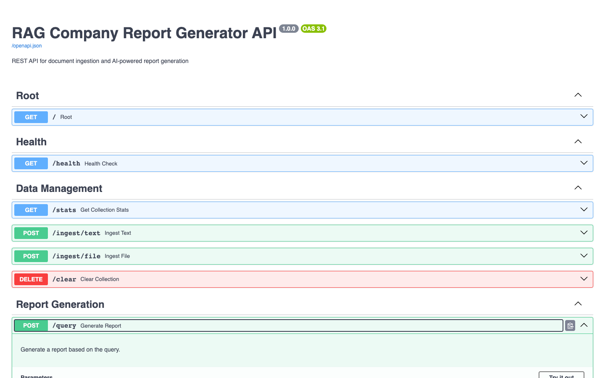
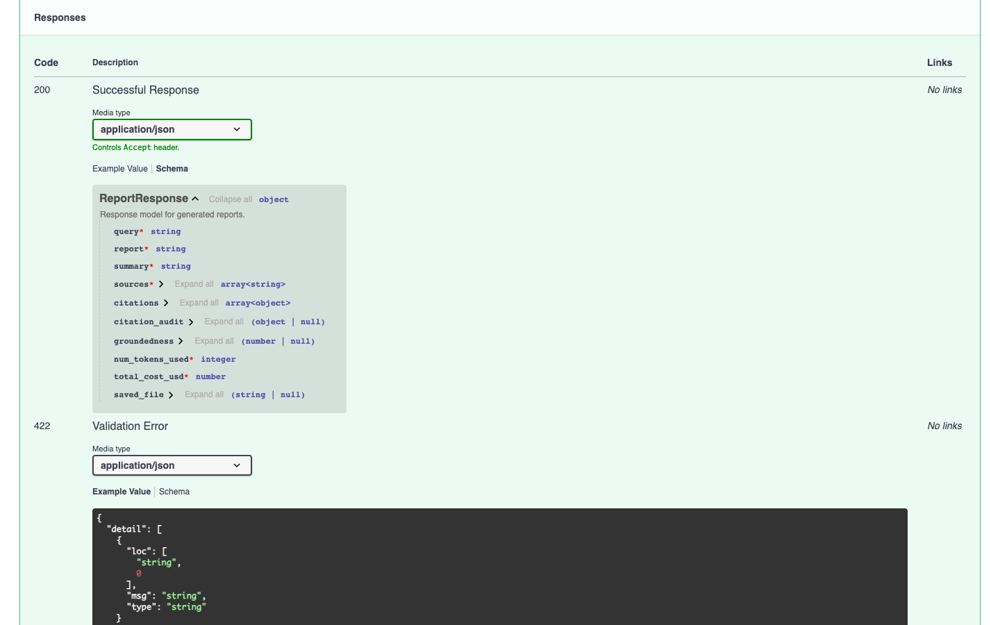
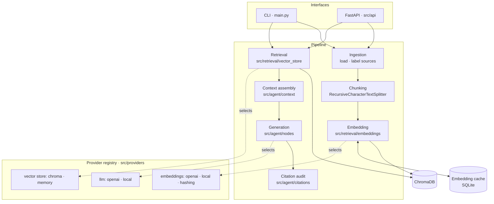
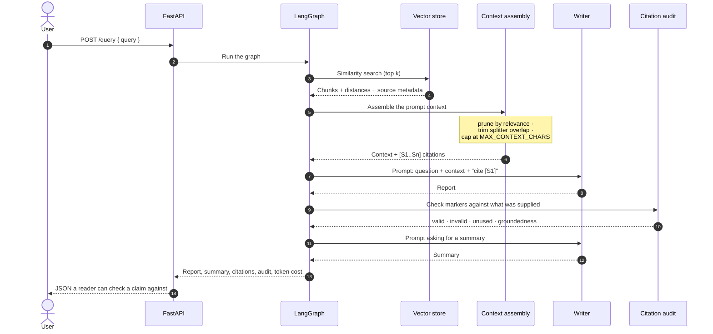
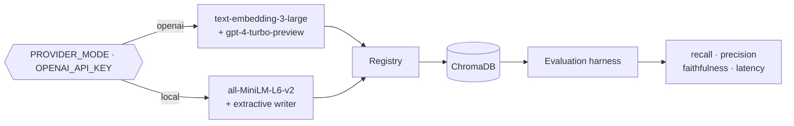

# RAG Report Generator

Ask a question about a set of company documents and get a written report back,
grounded in what those documents actually say. LangGraph orchestrates the
pipeline, ChromaDB stores the vectors, FastAPI and a CLI expose it.

Three things distinguish it from a minimal RAG demo. **Every claim is
traceable** — each report cites the chunks it was built from, and a check
verifies it did not invent a citation. **Retrieval quality is measured** by a
deterministic harness. And the whole pipeline **runs with no API key**, so
anyone who clones the repo can see both for themselves.

---

## Captured output

All of it real, produced with no API key set, on the sample corpus in
`data/raw_data/`. The full session — CLI, HTTP, the audit catching an invented
citation, the evaluation harness, the benchmark — is in
**[`docs/captured-output.md`](docs/captured-output.md)**.

A report from the CLI, trimmed to the parts that matter:

```console
$ LOG_LEVEL=WARNING python main.py --query "What do customers complain about most?"
📊 Vector store contains 6 document chunks

🔍 Query: What do customers complain about most?

================================================================================
DETAILED REPORT
================================================================================
## What do customers complain about most

The following passages were retrieved from the indexed documents and are reproduced verbatim.

- ## What customers complained about Reporting flexibility remains the largest source of dissatisfaction, named in 44 percent of negative responses. [S1]

- Customers want to build their own views rather than choose from fixed dashboards. [S1]

- Export limits were the second complaint, at 27 percent. [S1]

- # Customer Satisfaction — Q4 Review ## Headline numbers Net Promoter Score finished the quarter at 41, up from 33 in Q3 and 28 a year ago. [S2]

================================================================================
SOURCES
================================================================================
[S1] customer_satisfaction_q4.md  (distance 0.896)
[S2] customer_satisfaction_q4.md  (distance 1.207)

================================================================================
PROVENANCE
================================================================================
Groundedness: 1.00  (1.00 = every claim word is in a source)
Cited: S1, S2
```

Retrieval returned five chunks and the report cites two — the other three were
dropped because their distance from the query was more than 35% worse than the
best hit, and paying a model to read them would have bought nothing.

The same question over HTTP returns the provenance as data (report and summary
abridged here; the full response is in `docs/captured-output.md`):

```console
$ curl -s -X POST http://localhost:8350/query \
    -H 'Content-Type: application/json' \
    -d '{"query": "What do customers complain about most?"}'
{
  "query": "What do customers complain about most?",
  "report": "## What do customers complain about most\n\n...",
  "summary": "...",
  "sources": ["customer_satisfaction_q4.md", "customer_satisfaction_q4.md"],
  "citations": [
    {
      "id": "S1",
      "source": "customer_satisfaction_q4.md",
      "score": 0.8960953787447283,
      "excerpt": "## What customers complained about\n\nReporting flexibility remains..."
    },
    {
      "id": "S2",
      "source": "customer_satisfaction_q4.md",
      "score": 1.2067741668107794,
      "excerpt": "# Customer Satisfaction — Q4 Review\n\n## Headline numbers\n\nNet Promoter..."
    }
  ],
  "citation_audit": {
    "valid": ["S1", "S2"],
    "invalid": [],
    "unused": [],
    "groundedness": 1.0,
    "ungrounded_sample": []
  },
  "groundedness": 1.0,
  "num_tokens_used": 1099,
  "total_cost_usd": 0.0,
  "saved_file": null
}
```

And the audit earns its place by catching the failure it exists for — a marker
pointing at a source that was never supplied:

```console
supplied:     ['S1', 'S2']
cited:        ['S1']
INVENTED:     ['S7']
groundedness: 0.3
not in any source: ['antarctic', 'division', 'its', 'output', 'titanium', 'top', 'tripled']
```

The API browser, showing the response contract:





---

## Architecture

Five stages, each independently testable, wired together by a declarative
LangGraph state machine. The registry in `src/providers` is the seam: the chat
model, the embedder and the vector store are all selected by name, so none of
the stages below knows which backend is behind it.



Dependencies point inward. `src/agent/context.py`, `src/agent/citations.py` and
`src/evaluation/grounding.py` are pure functions over data — no settings, no
network, no framework — which is why the bulk of the test suite runs in
milliseconds without a vector store or a model.

---

## What happens when you ask a question



Each node returns **only the keys it changed**, never the whole state.
`retrieved_documents` carries an accumulating reducer, so a node that echoes
the state back re-appends the documents it was handed — four nodes doing that
turned `k` retrieved chunks into `8k` entries in the final state.

---

## Quickstart

### Docker

```bash
docker compose up --build
```

Then open **http://localhost:8350/docs**.

**No API key required.** With `OPENAI_API_KEY` unset the app selects a local
sentence-transformer for embeddings and an extractive writer for reports. The
container ingests `data/raw_data/` at startup, so there is something to ask
about immediately.

```bash
curl -X POST http://localhost:8350/query \
  -H 'Content-Type: application/json' \
  -d '{"query": "How much did revenue grow and which segment drove it?"}'
```

Add a key to `.env` to switch to OpenAI. Nothing else changes.

> The first build downloads PyTorch, which takes a while. The local embedding
> model is baked into the image at build time, so the first *request* is fast.

Tear down with `docker compose down -v`.

### Without Docker

```bash
python -m venv venv && source venv/bin/activate
pip install -r requirements.txt

cp .env.example .env        # optional: every value has a working default

python scripts/verify_setup.py          # checks config, deps, directories
python scripts/ingest_sample_data.py    # index data/raw_data/
python main.py --query "How much did revenue grow and which segment drove it?"
```

To serve the API instead of using the CLI: `make serve` (or
`./scripts/start_api.sh`), which binds **8350**.

---

## Configuration

Every value has a working default and `.env` is optional; `.env.example` lists
them all. Nothing is required — including the API key.

| Variable | Required | Default | What it does |
|---|---|---|---|
| `OPENAI_API_KEY` | no | *(empty)* | Present ⇒ OpenAI backends. Absent ⇒ local backends |
| `PROVIDER_MODE` | no | `auto` | `openai` or `local` forces a choice regardless of the key |
| `LLM_PROVIDER` | no | `auto` | Registered chat backend by name: `openai`, `local`, or one you register |
| `EMBEDDING_PROVIDER` | no | `auto` | Registered embedder: `openai`, `local`, `hashing` |
| `VECTOR_BACKEND` | no | `chroma` | Registered vector store: `chroma`, `memory` |
| `OPENAI_MODEL` | no | `gpt-4-turbo-preview` | Chat model |
| `OPENAI_EMBEDDING_MODEL` | no | `text-embedding-3-large` | Embedding model |
| `OPENAI_REQUEST_TIMEOUT` | no | `60` | Seconds before a chat or embedding call is abandoned |
| `OPENAI_MAX_RETRIES` | no | `3` | Retries on transient API failures |
| `LOCAL_EMBEDDING_MODEL` | no | `sentence-transformers/all-MiniLM-L6-v2` | Offline embedding model |
| `HASHING_DIMENSIONS` | no | `256` | Width of the model-free embedder used by benchmarks |
| `ENABLE_EMBEDDING_CACHE` | no | `true` | Serve repeated `(model, text)` embeddings from disk |
| `EMBEDDING_CACHE_PATH` | no | `./data/embedding_cache.sqlite` | SQLite file backing that cache |
| `CHUNK_SIZE` | no | `1000` | Characters per chunk |
| `CHUNK_OVERLAP` | no | `200` | Characters repeated between adjacent chunks; must be smaller than `CHUNK_SIZE` |
| `TOP_K_RESULTS` | no | `5` | Chunks retrieved per query |
| `MAX_CONTEXT_CHARS` | no | `12000` | Hard cap on the context assembled into one prompt |
| `CONTEXT_RELEVANCE_MARGIN` | no | `0.35` | Drop chunks more than this fraction worse than the best hit; `0` disables |
| `CHROMA_PERSIST_DIRECTORY` | no | `./data/chroma_db` | Where the index lives |
| `CHROMA_COLLECTION_NAME` | no | `company_data` | Collection name |
| `MAX_REPORT_LENGTH` | no | `2000` | Target report length in tokens |
| `REPORT_OUTPUT_DIR` | no | `./reports` | Where `--output` writes |
| `ENABLE_COST_TRACKING` | no | `true` | Per-call cost logging to `COST_LOG_FILE` |
| `COST_LOG_FILE` | no | `./logs/cost_tracking.json` | Cost log path |
| `LOG_LEVEL` | no | `INFO` | Standard levels |
| `ENVIRONMENT` | no | `development` | `production` switches logs to JSON |
| `LOG_DIR` / `LOG_FILE` | no | `./logs` / `app.log` | Log destination |
| `PORT` | no | `8350` | Port `make serve` and `scripts/start_api.sh` bind |

Invalid combinations are rejected at startup rather than at first use: an
overlap at least as large as the chunk size, and an unrecognised
`PROVIDER_MODE`.

---

## Development

```bash
pip install -r requirements.txt

python -m pytest -q             # 282 tests, ~2 seconds
ruff check src/ tests/ scripts/ # linting; config in pyproject.toml
black src/ tests/ scripts/      # formatting, line length 100

python scripts/run_evaluation.py   # score retrieval; exits non-zero on regression
python scripts/benchmark.py        # measure chunking, caching, latency and cost
```

`make help` lists the shortcuts. To inspect the graph visually:
`./scripts/start_langgraph_studio.sh`, which runs `langgraph dev` against
`langgraph.json`.

**No test makes a network call.** Every OpenAI chat, embedding and HTTP call is
replaced by a fake, and `tests/conftest.py` blocks non-loopback sockets for the
whole session. That block is not taken on trust:
`tests/test_network_guard.py` *attempts* outbound connections — a raw socket, a
`connect_ex`, `socket.create_connection`, an `httpx.get` over HTTPS, and a
hostname that resolves off-box — and asserts every one is refused, while
loopback and the FastAPI `TestClient` keep working.

`tests/test_evaluation_harness.py` and the context, citation and grounding
tests run with none of the project's heavy dependencies loaded — those modules
import only the standard library, on purpose.

What the suite covers: chunk boundaries and overlap, retrieval ordering and
`k`, the provider registry, the embedding cache, context assembly and its three
reductions, citation extraction and auditing, grounding, prompt assembly, the
full graph end to end with both writers, source attribution through chunking,
cost accounting, the CLI, every API endpoint, document loading, the in-memory
store, the network guard, and the evaluation metrics themselves.

---

## Project structure

```
RAG-Report-Generator/
├── main.py                      CLI entry point
├── langgraph.json               LangGraph Studio → src/agent/studio_graph.py:graph
├── src/
│   ├── agent/
│   │   ├── graph.py             The declarative four-node state machine
│   │   ├── nodes.py             Node bodies; each returns only what it changed
│   │   ├── state.py             Typed state, with the accumulating document reducer
│   │   ├── context.py           Context assembly: prune, de-duplicate, budget, cite
│   │   ├── citations.py         Checks the report's markers against what was supplied
│   │   └── local_llm.py         Offline extractive writer; quotes and cites, never invents
│   ├── providers/
│   │   ├── registry.py          Named factories for llm / embeddings / vector store
│   │   └── builtin.py           The backends that ship, registered lazily
│   ├── retrieval/
│   │   ├── vector_store.py      Backend-agnostic wrapper over the configured store
│   │   ├── embeddings.py        OpenAI embeddings + cost tracking, and assembly
│   │   ├── embedding_cache.py   Content-addressed SQLite cache in front of any embedder
│   │   ├── local_embeddings.py  Lazy-loading sentence-transformer
│   │   ├── hashing_embeddings.py Model-free vectors for benchmarks and tests
│   │   └── memory_store.py      In-process store; no persistence, no index
│   ├── data_ingestion/          Loading, chunking, indexing
│   ├── evaluation/
│   │   ├── harness.py           Recall, precision, faithfulness, latency
│   │   └── grounding.py         The single groundedness implementation
│   ├── observability/           Structured logs and per-call cost tracking
│   ├── config/settings.py       Settings, validated at load
│   ├── utils/                   Document loader and text splitter
│   └── api/main.py              FastAPI surface
├── data/raw_data/               Three sample company documents (committed)
├── docs/captured-output.md      Real output from every command in this README
├── scripts/                     Setup check, ingestion, evaluation, benchmark
└── tests/                       pytest suite
```

---

## Design notes

### Both backends are real



| | With a key | Without |
|---|---|---|
| Embeddings | `text-embedding-3-large`, 3072 dims | `all-MiniLM-L6-v2`, 384 dims, local |
| Report | Generated by `gpt-4-turbo-preview` | Extractive — sentences quoted from the sources |
| Cost | Tracked per call | Zero, and billed to `local-extractive-writer` |
| Citations | Model cites `[S1]`; audited | Writer cites the chunk each sentence came from; audited |

The offline writer is **extractive on purpose**. A fake generative model would
have to invent prose, and inventing prose is the exact failure a retrieval
system exists to prevent. Every sentence it emits is present in the retrieved
text — and it carries the marker of the chunk it came from, so the citation
audit runs on the default keyless path rather than only on the path that costs
money to exercise.

The two backends produce vectors of different widths, so a Chroma directory
built by one cannot be queried by the other. Switching is logged as
`embedding_dimension_mismatch` at startup; clear the collection
(`python main.py --clear`) and re-ingest.

### Provenance is the feature

A report that names its sources is only better than one that does not if the
names are real. So the pipeline carries provenance end to end:

- `context.assemble_context` labels every chunk it puts in the prompt with an
  `[S1]`-style marker and records what it points at — document, excerpt,
  retrieval distance.
- The prompt asks for those exact markers. "Cite the sources" is a hope; `[S3]`
  is a machine-checkable claim.
- `citations.audit_report` compares what the report cited against what was
  supplied, and returns three lists: **valid**, **invalid** (invented), and
  **unused** — the last being a cost signal rather than an error, because it
  means the prompt carried context the answer did not need.
- `evaluation.grounding` scores what share of the report's content words appear
  in the cited text. It is one implementation used in two places — the harness
  and the graph — because a score shown to a user and a score printed by CI
  that were computed differently is worse than having only one of them.

Groundedness is blunt and documented as blunt: word overlap cannot tell a
paraphrase from an invention. It is a floor, not a verdict. What it does catch
is a report drifting onto subjects the sources never mentioned. The query is
excluded from the score, because reports echo the question in a heading and the
user's own words are neither grounded nor invented — counting them scored a
perfectly faithful extract at 0.84.

### Scalability: the bill is the bottleneck

The bottleneck in a RAG system is not CPU, it is the prompt. Every character
assembled into context is billed as an input token on **every** query, and the
old assembly concatenated all `k` retrieved chunks with nothing but a character
cap between it and the model's context limit. Measured with
`scripts/benchmark.py`:

**Context is now reduced three ways before it is paid for.**

| | before | after |
|---|---|---|
| Mean report prompt (6 eval questions, real embedder, `k=5`) | 921 tokens | **588 tokens** |
| Cost per report at `gpt-4-turbo-preview` pricing | $0.0982 | **$0.0949** |

Only 3.4% on cost, and that number is reported rather than dressed up: a
report's 2,000 *output* tokens are billed at 3× the input rate and none of this
touches them. The input side is the part that grows, so the input side is the
part that had to be bounded — and that is where it shows:

| `k` | naive prompt | bounded prompt | $ before | $ after | saving |
|---:|---:|---:|---:|---:|---:|
| 5 | 1,003 | 1,003 | 0.0990 | 0.0990 | 0.0% |
| 10 | 1,856 | 1,856 | 0.1076 | 0.1076 | 0.0% |
| 20 | 3,529 | 2,841 | 0.1243 | 0.1174 | 5.5% |
| 40 | 6,901 | 2,861 | 0.1580 | 0.1176 | 25.6% |
| 80 | 13,594 | 2,861 | 0.2249 | **0.1176** | **47.7%** |

*(synthetic 1,200-chunk corpus, so the question is meaningful; the shipped
corpus is six chunks and `k=5` retrieves most of it.)*

The naive prompt grows linearly with `k` forever. The bounded one plateaus.
Cost per report stops being a function of a knob someone can turn without
noticing.

The three reductions, in order:

1. **Relevance pruning.** Retrieval returns exactly `k` chunks whether or not
   `k` are relevant. Chunks whose distance is more than
   `CONTEXT_RELEVANCE_MARGIN` worse than the best hit are dropped. On the six
   evaluation questions this drops 2-3 of every 5 retrieved chunks. The
   comparison is *relative* to the best hit, not an absolute threshold, because
   the absolute scale differs between embedding backends — and it declines to
   act when a backend reports similarity rather than distance, since pruning
   with the wrong polarity would drop exactly the best hits.
2. **Overlap de-duplication.** `CHUNK_OVERLAP=200` deliberately repeats text
   between adjacent chunks, which costs 5.6% duplication in the index. When
   retrieval returns two adjacent chunks — common, because adjacent chunks are
   about the same thing — that overlap was sent to the model twice.
3. **Budgeting.** What survives is capped at `MAX_CONTEXT_CHARS` rather than
   growing until the model rejects the request.

**Embeddings are cached.** They are a pure function of `(model, text)` and the
pipeline recomputed them constantly: re-ingestion re-embedded every chunk, and
a repeated query re-embedded the query. A content-addressed SQLite cache makes
the second pass free — the benchmark's warm run issues **zero** embedding
calls. SQLite rather than a pickle because it survives a crash mid-write and
handles two processes ingesting at once. The key is a hash of the model name
*and* the text, so a vector from one backend can never be served to another —
that failure does not raise, it silently retrieves the wrong chunks.

**Query latency is linear in the corpus without an index**, which is why the
default store is Chroma and the in-memory one is for benchmarks:

| chunks | index build | p50 query | p95 query |
|---:|---:|---:|---:|
| 6 | 0.7 ms | 0.15 ms | 0.16 ms |
| 48 | 4.2 ms | 1.10 ms | 1.17 ms |
| 384 | 33.9 ms | 9.04 ms | 9.18 ms |
| 1,536 | 136.8 ms | 35.72 ms | 37.36 ms |

*(brute-force cosine, hashing embedder — measuring the shape of the curve, not
absolute speed.)*

### Extensibility: one seam, three sockets

Three things in this pipeline are genuinely replaceable: the chat model, the
embedder, and the store the vectors live in. Everything else is arithmetic over
their outputs. Before `src/providers`, replacing any of them meant editing an
`if settings.use_openai:` branch buried in the module that used it, and the
three branches lived in three different files.

Now a backend is a name and a factory:

```python
from src.providers import register_llm

def make_ollama(settings):
    from langchain_community.chat_models import ChatOllama
    return ChatOllama(model="llama3")

register_llm("ollama", make_ollama)
```

and `LLM_PROVIDER=ollama` selects it. Factories import lazily — registering
every provider eagerly would make a process running entirely on OpenAI pay the
import cost of `sentence_transformers` and torch, and would make the offline
path untestable on a machine without them. An unregistered name fails
immediately and names the alternatives, rather than falling back to a default
that quietly bills someone.

Two of the three sockets are already filled by more than the obvious backend,
which is how the seam stays honest: `hashing` embeddings and the `memory`
vector store exist because benchmarking latency and reproducing a ranking bug
should not require loading 90 MB of weights.

### Evaluation

`scripts/run_evaluation.py` scores six questions whose answers a human can
check by opening the three sample documents. A question set nobody can verify
by hand is not a test.

```
backend=local pass=6/6 recall=1.00 precision=0.40 faithfulness=0.98 p95=6399ms
  citation groundedness: mean 1.00

  ✓ revenue-growth     recall=1.00 precision=0.40 faith=0.94 6399ms
  ✓ margin             recall=1.00 precision=0.40 faith=0.98   19ms
  ✓ complaints         recall=1.00 precision=0.40 faith=0.99    6ms
  ✓ nps                recall=1.00 precision=0.40 faith=0.99   18ms
  ✓ modules            recall=1.00 precision=0.40 faith=0.98   33ms
  ✓ deployment         recall=1.00 precision=0.40 faith=0.99   19ms
```

The p95 is entirely the first query, which pays to load the embedding model
into memory. Every subsequent query is 6-33 ms. The number is reported as
measured rather than as a warm-cache average, because a cold start is a real
user's first impression.

| Metric | What it means | Why it is here |
|---|---|---|
| **recall** | Did the documents that answer the question surface | The most common RAG failure |
| **precision** | What share of what came back was wanted | Catches a retriever that returns everything |
| **faithfulness** | Report content words present in the retrieved text | Catches a report drifting off its sources |
| **invented citations** | Markers cited that were never supplied | A defect, not a quality level — one fails the run |
| **p95 latency** | Slowest realistic request | Retrieval quality bought with unusable latency is not a win |

Precision of 0.40 is arithmetic, not a failure: six chunks in the corpus and
`TOP_K_RESULTS=5` means at most two of the five returned can come from the one
expected document. It is reported rather than hidden because a precision number
without its denominator is meaningless.

Every metric is deterministic. **No model judges another model's output** — an
LLM-as-judge lets the system grade its own homework and makes the score drift
for reasons unrelated to any change in the code. The script exits non-zero when
mean recall drops below 0.80, mean faithfulness below 0.50, or any report cites
a source it was never given, so it works as a CI gate.

---

## Limitations

- **Offline reports are extractive.** They quote and cite rather than
  synthesise, so they read as evidence rather than as prose. Narrative quality
  needs a real model.
- **Groundedness is lexical.** Word overlap cannot distinguish a good
  paraphrase from an invention. It is a floor, not a verdict.
- **The citation audit checks form, not truth.** It proves a marker was
  supplied and that the report's vocabulary came from the cited text. It cannot
  tell you the sentence actually supports the claim attached to it.
- **One collection, no tenancy.** Everything ingested shares a namespace, and
  the API's CORS policy allows all origins — fine for a local demo, not for a
  shared deployment.
- **Ingestion is synchronous.** A large upload occupies the request; a queue is
  the obvious next step.
- **No re-ranking.** Retrieval is plain top-`k` cosine similarity followed by
  the relevance filter. A cross-encoder re-ranker would do better than a
  distance threshold.
- **Relevance pruning is a heuristic with one knob.** A margin that is right
  for one corpus can be wrong for another, and it declines to act at all
  against a backend that reports similarity rather than distance.
- **The sample corpus is tiny** — three documents, six chunks. It is enough to
  verify correctness by hand and too small to show most of the scalability
  work, which is why `scripts/benchmark.py` also runs against a synthetic
  corpus and labels it as synthetic.
- **The local model is weaker on long text.** 384 dimensions against 3072,
  which is why the evaluation reports the backend alongside the score.
