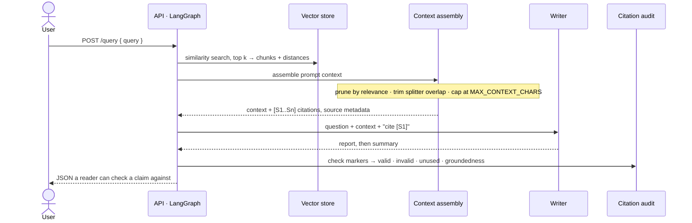

# RAG Report Generator

Ask a question about a folder of company documents and get a written report back,
where every line carries the marker of the chunk it came from and a check says
whether those markers were real. LangGraph runs the pipeline, ChromaDB holds the
vectors, a CLI and a FastAPI service expose it. It needs **no API key** — local
embeddings, an extractive writer — so all of it is reproducible from a clone.

## A report, and the receipts

Trimmed from a real session; the full transcript is in
**[`docs/captured-output.md`](docs/captured-output.md)**.

```console
$ LOG_LEVEL=WARNING python main.py --query "What do customers complain about most?"
- ## What customers complained about Reporting flexibility remains the largest source of dissatisfaction, named in 44 percent of negative responses. [S1]
- Export limits were the second complaint, at 27 percent. [S1]
[S1] customer_satisfaction_q4.md  (distance 0.896)
[S2] customer_satisfaction_q4.md  (distance 1.207)
Groundedness: 1.00  (1.00 = every claim word is in a source)
Cited: S1, S2
```

Retrieval returned five chunks and the report cites two: the other three sat more
than 35% farther from the query than the best hit (`CONTEXT_RELEVANCE_MARGIN`). The
audit exists for the failure that looks like success — a marker pointing at a source
never supplied. Section 3 swaps in a writer citing `[S7]` when only `S1` and `S2` were
supplied: the audit returns `INVENTED: ['S7']`, groundedness 0.3, the graph logs
`invented_citations` at ERROR and `scripts/run_evaluation.py` fails the run. The same
provenance is data on `/query`, captured with the generated
[Swagger](docs/screenshots/api-docs.png) and [schema](docs/screenshots/api-query-response.png).

## Run it

```bash
docker compose up --build            # then http://localhost:8350/docs
```

The container indexes `data/raw_data/` at startup, so there is something to ask. Or:

```bash
python -m venv venv && source venv/bin/activate
pip install -r requirements.txt
cp .env.example .env                      # optional; every value has a default
python scripts/verify_setup.py            # config, deps, directories
python scripts/ingest_sample_data.py      # index data/raw_data/
python main.py --query "How much did revenue grow and which segment drove it?"
```

`make serve` (or `./scripts/start_api.sh`) binds the API on **8350**; `make help`
lists the rest. Set `OPENAI_API_KEY` and the backends become
`text-embedding-3-large` and `gpt-4-turbo-preview` with cost tracked per call;
without it, `all-MiniLM-L6-v2` (384 dims against 3072) and the extractive writer.
Vector widths differ, so switching needs `python main.py --clear` and a re-ingest —
the mismatch is logged as `embedding_dimension_mismatch` at startup. `.env.example`
documents every setting; `tests/test_settings.py` fails if it and `Settings` drift.

## What happens when you ask a question



Four nodes, each returning **only the keys it changed** — load-bearing, because
`retrieved_documents` carries an accumulating reducer, so a node echoing the whole
state back re-appends the documents it was handed, and four nodes doing that turn
`k` retrieved chunks into `8k` entries; four tests in `tests/test_agent_nodes.py`
pin the key set each node may return. `context.py`, `citations.py` and
`evaluation/grounding.py` are pure functions over the standard library alone, so most
of the suite runs with no store and no model.

## Where the money goes

The bottleneck is the prompt, not CPU: every character assembled into context is billed
as an input token on *every* query. Assembly prunes chunks far from the best hit, trims
the overlap the splitter adds between adjacent chunks (5.6% duplication at
`CHUNK_OVERLAP=200`, measured), then caps at `MAX_CONTEXT_CHARS`. At shipped defaults
over the six evaluation questions with the real local embedder, the mean report prompt
goes **921 → 588 tokens (−36.1%)** and cost per report **$0.0982 → $0.0949 (−3.4%)**.

**3.4% is the honest headline and it is small for a reason**: a report's 2,000 *output*
tokens bill at 3× the input rate and none of this touches them. Pruning fires hard — two
or three of every five chunks dropped — but output dominates one report at `k=5`. The
input side is what *grows*, so that is where it shows (a synthetic 1,200-chunk corpus,
since the shipped one is six chunks):

| `k` | naive prompt | bounded prompt | $ naive | $ bounded | saving |
|---:|---:|---:|---:|---:|---:|
| 5 | 1,003 | 1,003 | 0.0990 | 0.0990 | 0.0% |
| 10 | 1,856 | 1,856 | 0.1076 | 0.1076 | 0.0% |
| 20 | 3,529 | 2,841 | 0.1243 | 0.1174 | 5.5% |
| 40 | 6,901 | 2,861 | 0.1580 | 0.1176 | 25.6% |
| 80 | 13,594 | 2,861 | 0.2249 | **0.1176** | **47.7%** |

Naive grows linearly with `k` forever; bounded plateaus. Pruning shows zero there
because the hashing embedder used for that run is semantically blind, which the
benchmark says — `MAX_CONTEXT_CHARS` does the work. A content-addressed SQLite cache
fronts any embedder too (warm ingestion issues **zero** embedding calls), keyed on the
model name *and* the text, since one backend's vectors served to another return the
wrong chunks silently.

## Scoring retrieval without an LLM judge

`scripts/run_evaluation.py` scores six questions a human can check by hand:

```
backend=local pass=6/6 recall=1.00 precision=0.40 faithfulness=0.98 p95=6399ms
  citation groundedness: mean 1.00
  ✓ revenue-growth     recall=1.00 precision=0.40 faith=0.94 6399ms
  ✓ complaints         recall=1.00 precision=0.40 faith=0.99    6ms
```

Precision of 0.40 is arithmetic, not a failure: six chunks in the corpus and
`TOP_K_RESULTS=5` means at most two of the five returned can come from the one
expected document. The p95 is entirely the first query paying to load the embedding
model — the rest are 6–33 ms — and is reported as measured, because a cold start is a
real user's first impression. Every metric is deterministic: **no model judges another
model's output**. Groundedness is lexical overlap with the text the report was given,
the query excluded. The run exits non-zero below 0.80 mean recall, below 0.50 mean
faithfulness, or on any invented citation.

## Swapping a backend

The chat model, the embedder and the vector store go through one seam,
`src/providers/registry.py`, named by `LLM_PROVIDER` / `EMBEDDING_PROVIDER` /
`VECTOR_BACKEND`:

```python
from src.providers import register_llm

def make_ollama(settings):
    from langchain_community.chat_models import ChatOllama   # imported lazily
    return ChatOllama(model="llama3")

register_llm("ollama", make_ollama)
```

Factories import inside the body, so registering providers does not make an OpenAI-only
process pay for importing `sentence_transformers` and torch — a test asserts registering
them leaves `torch` no more present in `sys.modules` than it already was. An unregistered
name raises immediately and names the alternatives rather than defaulting to something
that quietly bills someone. Two sockets hold a non-obvious occupant, `hashing` embeddings
and the `memory` store, so benchmarking needs no model weights.

## What is verified, and how far

`python -m pytest -q` runs **282 passing** tests; `ruff check` and `black --check`
over `src/ tests/ scripts/` are clean, config in `pyproject.toml`. **None of those
tests can reach the network.** Every OpenAI chat, embedding and HTTP call is faked
and `tests/conftest.py` blocks non-loopback sockets — not on trust: the 7 tests in
`tests/test_network_guard.py` *attempt* outbound connections and assert each is refused:
a raw `socket.connect`, a `connect_ex` (which returns a code instead of raising, so it
would slip past a connect-only guard), `socket.create_connection`, a real `httpx.get`
over HTTPS, a hostname resolving off-box — while loopback and the FastAPI `TestClient`
still work. Stated limits: it patches `socket.socket.connect`/`connect_ex`, covering
every in-process TCP client including TLS, but **not** UDP, raw sockets, or a
subprocess.

**Dependency pins are partially verified.** All 32 pins in `requirements.txt` match the
installed versions in the environment that runs the suite, the harness and the benchmark,
and `pip check` finds no broken requirements. Not verified: a cold
`pip install -r requirements.txt` from PyPI into an empty environment, and resolution on
Python 3.11 — the Dockerfile uses `python:3.11-slim`, but all of this ran on 3.12.6.

**The image has not been built or booted here.** This repo's uplift report records
`Build verified: NOT RUN — deferred, RAM constraint` and the same for boot; what was
checked is `docker compose config -q`, which parses cleanly. That build is exactly the
cold install on 3.11 above, so running it would close both gaps.

## Known gaps

- **Offline reports are extractive** — they quote and cite rather than synthesise.
  Groundedness is lexical, so overlap cannot tell a paraphrase from an invention, and
  the audit checks form, not truth: that a marker was supplied and the vocabulary came
  from the cited text, not that it supports the claim.
- **No re-ranking** — plain top-`k` cosine plus a distance threshold. Pruning is a
  heuristic with one global knob, and it declines to act at all against a backend
  reporting similarity rather than distance, since the wrong polarity would drop the
  best hits.
- **One collection, no tenancy**, `allow_origins=["*"]`, synchronous ingestion.
- **The sample corpus is tiny** — three Markdown documents, six chunks: enough to check
  by hand, too small for the scalability work to show. Those files are deliberately
  tracked (`data/*` is gitignored with a narrowed exception for `data/raw_data/*.md`) so
  a clean clone has something to retrieve.
- `langchain_community.vectorstores.Chroma` is deprecated; not yet migrated.
